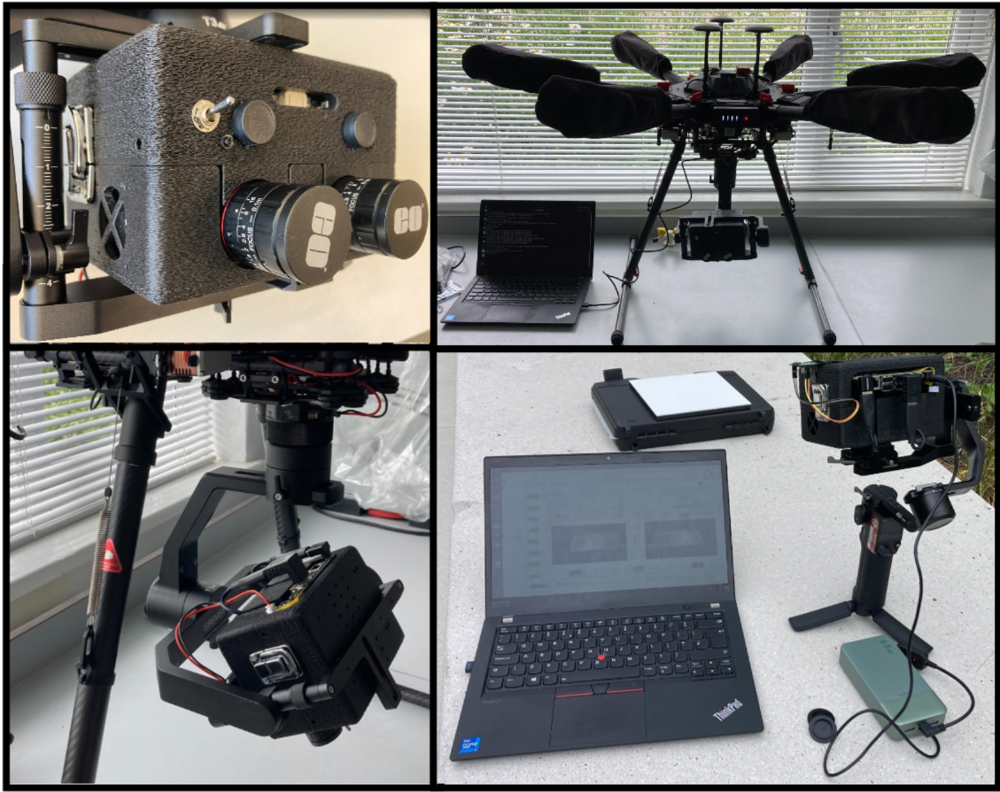
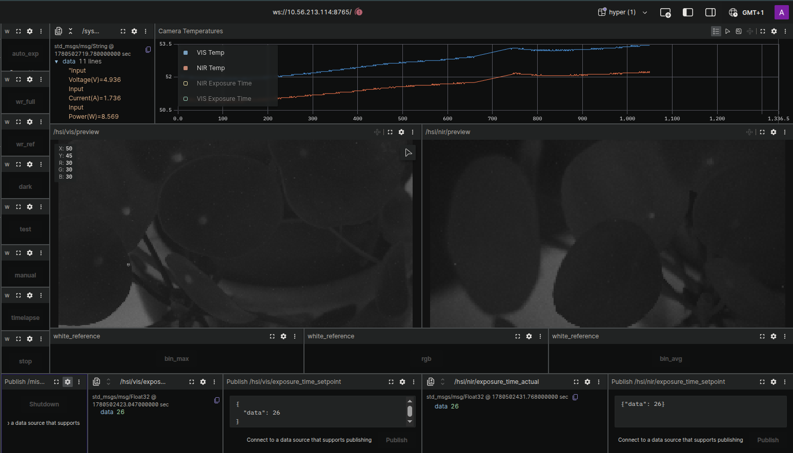

# Hyperspectral Payload




# Folder Structure

```
hyperspectral-payload/
├── 3D_models/              CAD models (STL) for the payload enclosure and sensor mounts.
├── figures/                Documentation images, including the system overview photo.
├── foxglove/               Foxglove Studio layout configs and generator for live ROS visualization.
├── processing/             Offline Jupyter notebooks for post-run HSI data analysis.
└── ros2_ws/                Main ROS 2 workspace — onboard drivers, processing, and launch files.
    └── src/
        ├── bringup/        Top-level launch files that start cameras, previews, and related nodes.
        │   └── hsi_bringup/
        ├── common/         Shared Python utilities used across HSI packages.
        │   └── hsi_python_utils/
        ├── controller/     System-level controller nodes for coordinating the platform.
        │   └── hsi_system_controller/
        ├── monitoring/     Onboard power and memory usage monitoring.
        │   └── system_profiler/
        ├── processing/     Real-time image processing pipelines.
        │   ├── hsi_binned_preview_cpp/     Downsampled max/avg/colour previews for HSI streams.
        │   ├── radiometric_processing/       Online and offline radiometric processing of raw cubes.
        │   └── stereo_binned_preview_cpp/    Stereo rectification, disparity, and binned previews.
        └── sensors/        Hardware drivers for all payload sensors.
            ├── gps_monitor_cpp/              DFRobot USB GPS receiver — publishes NavSatFix.
            ├── hsi_camera_driver_cpp/        IMEC mosaic hyperspectral camera driver (VIS and NIR).
            ├── imu/                          IMU on the Waveshare stereo camera board (I2C).
            ├── spectrometer/                 AS7341 spectrometer — publishes spectral curves.
            └── stereo_camera/                IMX219 stereo camera — raw left/right image streams.
```

# ROS 2 workspace

## Intro

This repo is a working progress for the open source hyperspectral payload project, it includes all code and 3d prints necessary for reproducing and running the payload. Note that the system relies on having the specific MQ022HG-IM-SM4X4-VIS3 & MQ022HG-IM-SM5X5-NIR2 Ximea XiSpec hyperspectral sensors and IMEC API for grabbing/processing. 

### Dependencies
- IMEC API (provided with Ximea XiSpec camera purchase)
- ROS2 Humble distro 
- Developed on Jetson Orin Nano running Jetpack 6.2.1


### Setup
1. Clone repo to the Jetson Nano and install dependencies.
1. From \ros2_ws run:

```
source /opt/ros/humble/setup.bash
colcon build
source install/setup.sh
```

1. 3D print case parts.
1. Install hardware into case.
1. Connect Jetson to the same wifi network as the remote PC, can be a wifi hotspot generated from a laptop.
1. Import the foxglove layout file (master_layout.json) to either the web or desktop version of the foxglove UI on the remote PC, connect to the IP address of the Jetson. 
1. SSH to the Jetson and from \ros2_ws launch system with full system launch command, this will also launch the foxglove bridge to allow communication with foxglove UI over the network.

'ros2 launch hsi_bringup full_system.launch.py run_name:=default_run_name acquisition_rate_hz:=20.0 throttled_rate_hz:=20.0'

### Data Collection Procedure

From the foxglove UI you need to set the integration times, and record calibration images using the buttons and message send options. An example of the interface is shown below:



The visible image is in the left panel with nir in the right. The camera sensor temperatures are displayed in the top right panel, these should be stable before recording a session to prevent thermal drift effects in the sensors. The other_sensors tab will show the RGB stereo images and resulting depth image, as well as other sensor outputs like gps. 

1. Remove lens caps set F#, focus with the hyperspectral cameras, higher F#'s allow a greater Field Of View and hence more reliable imaging. 

1. The buttons down the left side are roughly followed from top to bottom:
- auto_exp - this will "reduce" the exposure/integration times of both sensors until no overexposure is imaged, the hsi image panels will show a grayscale image with red for overexposure to check. The exposure can be set manually using the data send panels along the bottom, by changing the int value after {"data": 10} and clicking the publish button. 
- wr_full - records a non-uniformity white reference in which the white reference panel should fill the full image. 
- wr_ref - records a reference white reference, an image that has the white reference in view but does not fill the full sensor. 
- dark - records a dark reference image. Lens caps should be placed on the sensors before taking this.
- test - records a test image that will be saved in the context folder. 
- manual - records a manual image that will be saved in the timelapse folder but will be titled "manual_#.raw".
- timelapse - triggers the timelapse recording at the configuration set at launch. 
- stop - stops the timelapse recording. 
- shutdown - triggers a graceful shutdown of the system. 


# Other

## Build

From /ros2_ws directory:

```bash
source /opt/ros/humble/setup.bash
colcon build --symlink-install
source install/setup.bash
```


### Serial port permissions

The GPS receiver connects over USB serial (default `/dev/ttyACM0`). Without access to that device, `gps_monitor_cpp` fails with `open serial port: Permission denied`.

Do **not** run the node with `sudo` — that breaks ROS networking. Add your user to the `dialout` group instead (requires admin/sudo once):

```bash
sudo usermod -aG dialout $USER
```

Log out and log back in (or reboot), then verify:

```bash
groups                    # should list dialout
ls -la /dev/ttyACM0
ros2 run gps_monitor_cpp gps_monitor
```

To test in the current shell without logging out:

```bash
newgrp dialout
ros2 run gps_monitor_cpp gps_monitor
```

If you do not have sudo access, ask a system administrator to run `sudo usermod -aG dialout <username>` for you.


## GPS monitor

Publishes `sensor_msgs/NavSatFix` on `/sensors/gps` from the DFRobot USB GPS receiver:

```bash
source install/setup.bash
ros2 run gps_monitor_cpp gps_monitor
```

Override the serial port if needed:

```bash
ros2 run gps_monitor_cpp gps_monitor --ros-args -p serial_port:=/dev/ttyACM0
```

To print raw parsed GPS data (via `printf`) and publish `NavSatFix` even without a satellite fix:

```bash
ros2 run gps_monitor_cpp gps_monitor --ros-args -p publish_invalid:=true
```

See [Serial port permissions](#serial-port-permissions) if the node cannot open the device.


# Waveshare IMX219-83 Stereo Camera and IMU

Required to run this on Jetson Orin Nano: 

`sudo /opt/nvidia/jetson-io/jetson-io.py`

and configure for "Configure Jetson 24pin CSI Connector" >> "Configure for IMX219 Dual"

Demo code can be downloaded to ros2_ws/src/sensors/stereo_camera

```
wget https://files.waveshare.com/upload/e/eb/D219-9dof.tar.gz
tar zxvf D219-9dof.tar.gz
```

Other support here: https://www.waveshare.com/wiki/IMX219-83_Stereo_Camera?srsltid=AfmBOorWuFfQRE-_HYuJ68v_UwhnOcubG3c15le9vecCWJEt1vMwFapg

For IMU use,respectively connect the SDA and SCL pins of the camera to pins 3 and 5
on the Jetson Nano.


# Spectrometer

Installs
```
sudo apt-get update
sudo apt-get install python3-pip i2c-tools libgpiod-dev
pip3 install Adafruit-Blinka adafruit-circuitpython-as7341
sudo usermod -aG i2c $USER
```

For testing:
```
export JETSON_MODEL_NAME=JETSON_ORIN_NANO
python3 spectrometer_test.py
```


# IMU

On pins 3 and 5 IMU shows up as addres 0x68 on i2c_7
`sudo i2cdetect -y -r 7`


## IMEC mosaic Python API — `LoadOpticalSetup` ctypes fix

`post_run_data_processing.ipynb` (and any code that calls `HSI_MOSAIC.LoadOpticalSetup()`) can fail with:

```text
ArgumentError: argument 1: TypeError: wrong type
```

This is **not** a missing file or UTF-8 encoding problem. The C API takes `char const*`, but the Python wrapper declares `ctypes.c_wchar_p` (expects a `str`) while passing `filename.encode('utf-8')` (`bytes`). ctypes rejects the argument before the DLL reads the XML.

**Fix** in `/opt/imec/hsi-mosaic/python_apis/hsi_mosaic/hsi_mosaic_api.py` (around the `mosaicLoadOpticalSetup` binding, line 487):

```python
# Before (broken):
__api_dll.mosaicLoadOpticalSetup.argtypes = [ctypes.c_wchar_p, ctypes.POINTER(OpticalSetup)]

# After (matches LoadContext and char const*):
__api_dll.mosaicLoadOpticalSetup.argtypes = [ctypes.c_char_p, ctypes.POINTER(OpticalSetup)]
```

Leave the call unchanged:

```python
result = __api_dll.mosaicLoadOpticalSetup(filename.encode('utf-8'), ctypes.byref(optical_setup))
```

Restart the Jupyter kernel (or re-import `hsi_mosaic`) after editing. This patch is overwritten if the IME SDK is reinstalled or upgraded.

