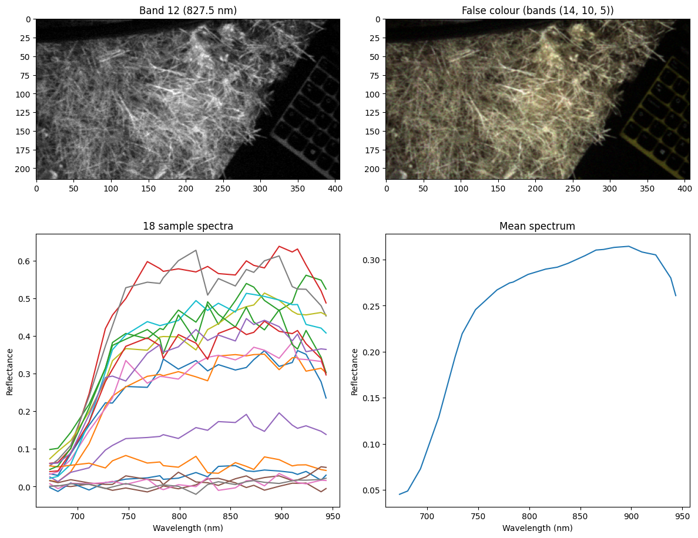

# Post-Processing Scripts

## post_run_data_processing.ipynb
- runs on jetson (required for ros environment for rosbag unpacking)
- uses HSI_MOSAIC api to radiometrically process the HSI images and outputs some inspected images (see below)

Example Output:

